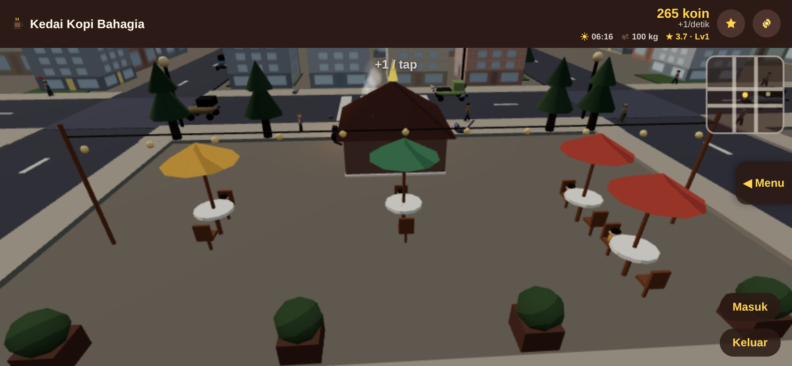
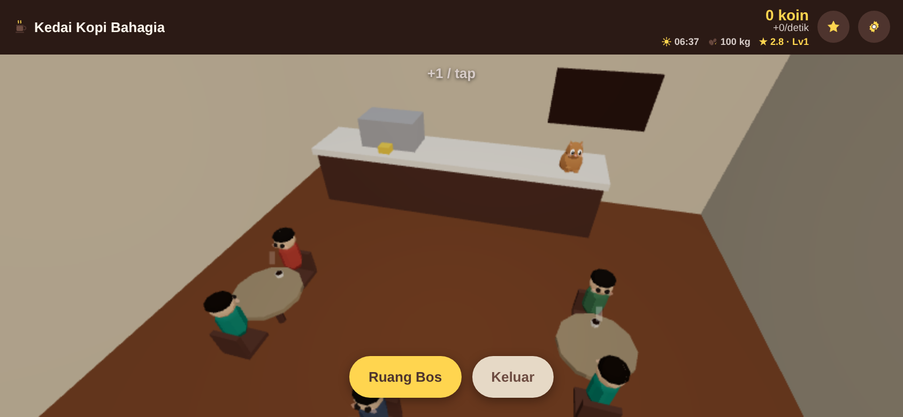
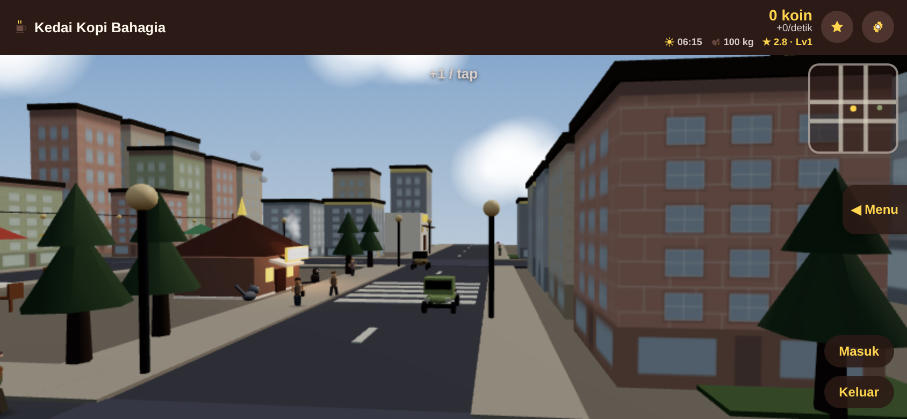
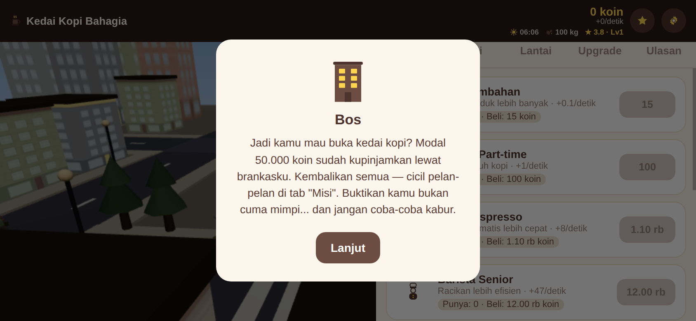
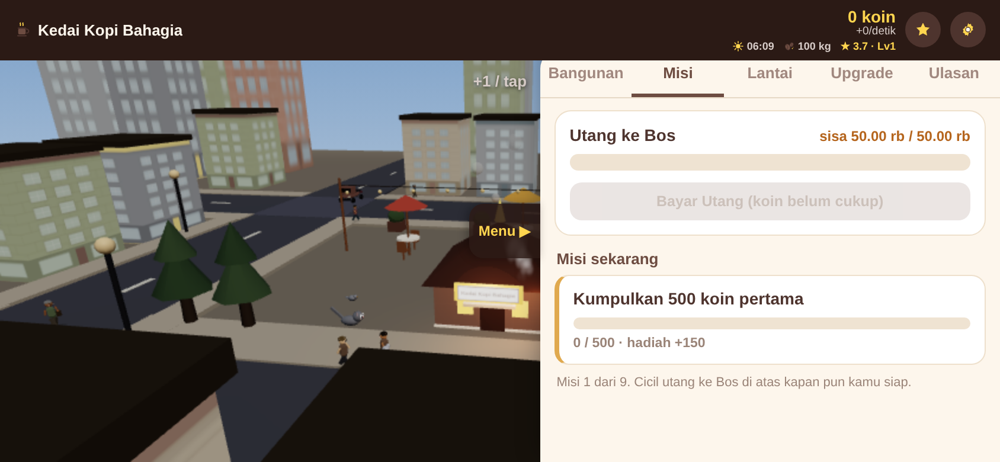
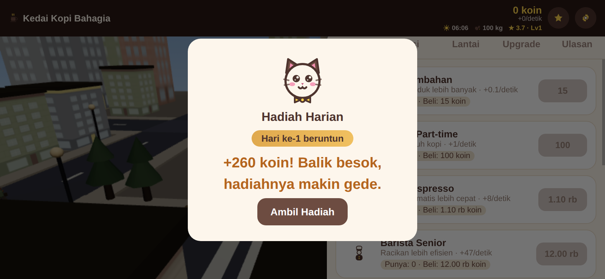

# ☕ Kedai Kopi Clicker

> Idle-management coffee-shop game for Android — grow a cozy café from a single
> table into a bustling city corner. Built with **Capacitor + Three.js**, fully
> **offline**, no ads, no tracking.

<p align="center">
  
  
</p>


---

## What is it?

An **idle / management** clicker set in a low-poly 3D city. Customers roll in and
buy coffee on their own, coins pile up, and you spend them on upgrades that
**physically appear in the world** — buy a table and a parasol, chairs, and a
seated customer pop up on the back patio. There's a light story (you owe the
**Boss** startup money and have to pay it back), a guided mission chain, a daily
login streak, and a whole living street with pedestrians, cars, cats, and
pigeons that scatter when a car drives by.

### Highlights

| | |
|---|---|
| 🏪 **Idle income** | The shop earns on its own — no frantic tapping required. |
| 🪑 **Visible upgrades** | Buy tables → parasols, chairs & customers appear on the patio. |
| 💸 **Story with stakes** | Repay the Boss's loan: 15% income cut while in debt, +20% forever once free. |
| 🎯 **Guided missions** | A 9-step chain with rewards and Boss dialogue that pulls you forward. |
| 🔥 **Daily streak** | Come-back reward that grows each consecutive day. |
| 🔔 **Reminders** | Local "your coffee is piling up" notifications (opt-in). |
| 🌆 **Living 3D city** | Day/night cycle, traffic, pedestrians, cats, pigeons, café interior + boss room. |
| ❄️ **Cool & smooth** | Frame-rate capped on idle scenes so the phone stays cool at max graphics. |

<p align="center">
  
  
</p>
<p align="center">
  
  
</p>

---

## Tech stack

- **[Three.js](https://threejs.org/)** `0.185` — all 3D rendering (city, café, characters), vendored as a single bundle in `www/vendor/`.
- **[Capacitor](https://capacitorjs.com/)** `8` — wraps the web app into a native Android shell.
  - `@capacitor/local-notifications` — come-back reminders.
- **Vanilla JS + HTML + CSS** — no framework, no bundler. The game is plain ES modules.
- **Web Audio API** — procedural lo-fi background music + SFX (no audio files → zero licensing).

Everything runs **100% offline**. The only Android permissions are `INTERNET`
(unused by gameplay) and `POST_NOTIFICATIONS`.

---

## Project structure

```
kedai-kopi-clicker/
├── www/                     # the actual game (web app)
│   ├── index.html           # layout + UI shell
│   ├── game.js              # game logic: economy, missions, debt, daily, UI
│   ├── cafe3d.js            # the entire 3D scene (city, café, characters, camera)
│   ├── icons.js             # inline SVG icon helper
│   ├── style.css            # all styling
│   └── vendor/              # vendored Three.js bundle
├── android/                 # native Android project (Capacitor)
│   └── app/src/main/…       # manifest, notification icon, resources
├── docs/
│   ├── BUILD.md             # ← how to build & run
│   ├── PUBLISHING.md        # ← how to ship to Google Play
│   └── screenshots/
├── capacitor.config.*       # Capacitor config
└── package.json
```

The game lives almost entirely in **`www/`**. `cafe3d.js` is the 3D world;
`game.js` is the game logic and UI wiring.

---

## Quick start

Requires **Node 18+**, **JDK 21**, and the **Android SDK** (with `adb`).

```bash
# 1. install deps
npm install

# 2. copy the web app into the native project
npx cap sync android

# 3. build a debug APK
cd android
JAVA_HOME=/path/to/jdk-21 ./gradlew assembleDebug

# 4. install onto a connected phone
adb install -r app/build/outputs/apk/debug/app-debug.apk
```

Editing the game = edit files in `www/`, then re-run `npx cap sync android` and
rebuild. **Full step-by-step (incl. signed release builds): [docs/BUILD.md](docs/BUILD.md).**

---

## Publishing to Google Play

Building a signed release bundle (`.aab`) and getting it onto the Play Store —
keystore creation, Play Console setup, store listing, data-safety, and release
tracks — is documented in **[docs/PUBLISHING.md](docs/PUBLISHING.md)**.

> ⚠️ **Signing keys are secret.** The release keystore and its passwords are
> **not** in this repo (they're git-ignored). Keep an encrypted backup — losing
> the key means you can never update the app on Play again.

---

## App info

| | |
|---|---|
| **App ID** | `id.dnayaka.kedaikopi` |
| **Min SDK** | per `variables.gradle` |
| **Gradle** | 8.14.3 (wrapper) · **JDK 21 required** |
| **Orientation** | landscape (locked) |

---

## Credits

Made by **Dnayaka**. Art is low-poly geometry generated in code; music & sound
are procedural (Web Audio) — no third-party assets, so the whole thing is
copyright-clean.

---

## License

Copyright (C) 2026 dnayaka

Licensed under the **GNU General Public License v3.0** — see
[LICENSE](LICENSE) for the full text. All dependencies (Capacitor, three.js)
are themselves permissively licensed (MIT), so this repo is 100% free/open
source software with no proprietary or non-free components.
